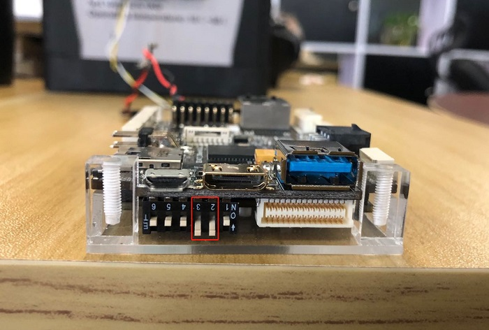
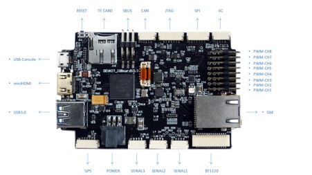

# Program the controller

## 1.Boot

Devkit support boot from sd card, copy these file to sd card:

```text
1.PhenixPro_Devkit/BOOT.BIN
2.PhenixPro_Devkit/amp_system/linux_image/devicetree.dtb
3.PhenixPro_Devkit/amp_system/linux_image/uImage
4.PhenixPro_Devkit/amp_system/linux_image/uramdisk.image.gz
```

**Note:**  
​ The directory of PhenixPro Devkit is RobSenseTech/PhenixPro\_Devkit\_V2.0...

set DIP switch like the image below\(it means boot from sd card\):



And the he print information is similar to general Linux startup information.

## 2.Connect UAV Components



As red words in image above, we can connect UAV component like this:

* Remote control receiver connect to **SBUS** \(pin order from top to bottom is signal, vcc, GND\)
* Four motors connected to **MOTO 1 to 4**, respectively \(pin order from top to bottom is signal, vcc, GND\)
* Ground station can be connected through **SERIAL** **4** port  on the board with baudrate 115200, while through other **SERIAL** ports with baudrate 57600.
* Connect power distribution board to **POWER**
* UAV head direction is the same as x axis which is marked in red box

