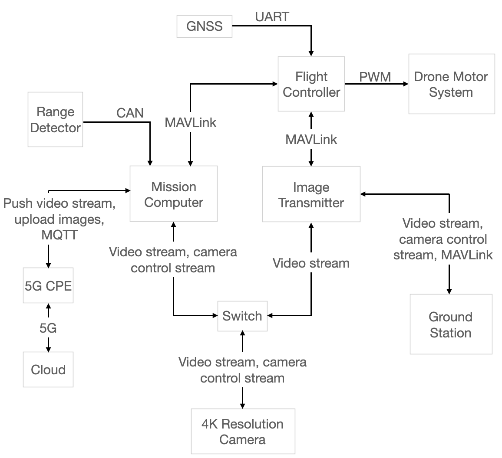

# Drone System Overview
Image below is a overview of the whole system of RST-I800 5G drone.

> **Mission Computer** 

Connected to Internet via 5G CPE, this component is mainly responsible for: control flight 
mission of the drone via cloud (with MQTT protocol), taking pictures and upload to cloud via
FTP protocol, use OBS software to video streaming and push streaming to user defined platforms.

> **Flight Controller (RST Phenix Mini)** 

Can communicate with QGC through image trasmitter. Taking order directly from mission computer, 
is responsible for controlling drone motors.

> **Digital Image Trasmitter** 

Responsible for trasmit video from on board camera to QGC in real time and controlling on board
camera.

> **On Board Camera** 

The function of camera has 3 parts:
- trasmit video to QGC in real time, allow GQC to control camera
- taking order from mission computer to taking/uploading images to cloud via FTP protocol
- allow OBS software in mission computer to video streaming to user defined platforms

> **Cloud** 

Cloud is consist of 2 parts: MQTT server and FTP server. Real time informations are sent to 
MQTT server, MQTT server can controll drone by communicating with mission computer. FTP server
stores images sent from drone.
